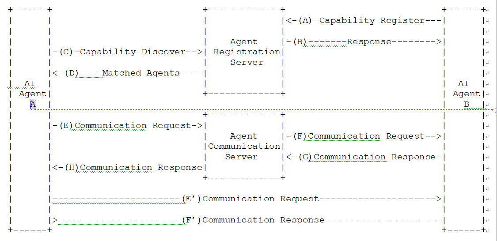
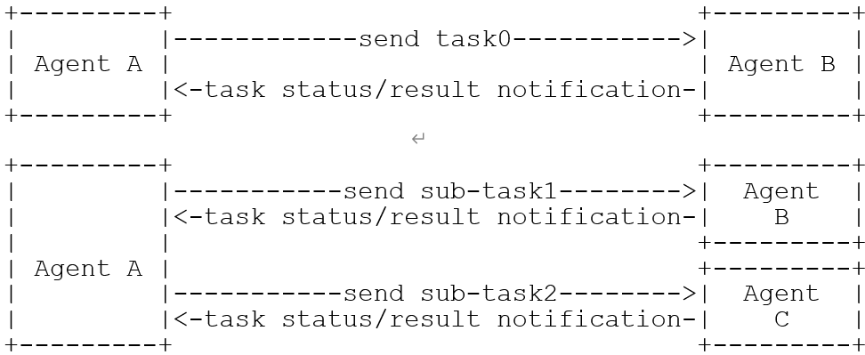

# Title: Framework for AI Agent Communication in Trust Domain

filename : draft-<ietf-wgname-docname>-00.txt

## Status of this Memo

This Internet-Draft is submitted in full conformance with the provisions of BCP 78 and BCP 79. 
This Internet-Draft is submitted in full conformance with the provisions of BCP 78 and BCP 79. This document may not be modified, and derivative works of it may not be created, and it may not be published except as an Internet-Draft.
This Internet-Draft is submitted in full conformance with the provisions of BCP 78 and BCP 79. This document may not be modified, and derivative works of it may not be created, except to publish it as an RFC and to translate it into languages other than English.
This document may contain material from IETF Documents or IETF Contributions published or made publicly available before November 10, 2008. The person(s) controlling the copyright in some of this material may not have granted the IETF Trust the right to allow modifications of such material outside the IETF Standards Process.  Without obtaining an adequate license from the person(s) controlling the copyright in such materials, this document may not be modified outside the IETF Standards Process, and derivative works of it may not be created outside the IETF Standards Process, except to format it for publication as an RFC or to translate it into languages other than English.
Internet-Drafts are working documents of the Internet Engineering Task Force (IETF), its areas, and its working groups.  Note that other groups may also distribute working documents as Internet-Drafts.
Internet-Drafts are draft documents valid for a maximum of six months and may be updated, replaced, or obsoleted by other documents at any time.  It is inappropriate to use Internet-Drafts as reference material or to cite them other than as "work in progress."
The list of current Internet-Drafts can be accessed at http://www.ietf.org/ietf/1id-abstracts.txt
The list of Internet-Draft Shadow Directories can be accessed at http://www.ietf.org/shadow.html
This Internet-Draft will expire on April 16, 2009.

## Copyright Notice

Copyright (c) 2025 IETF Trust and the persons identified as the document authors. All rights reserved.
This document is subject to BCP 78 and the IETF Trust’s Legal Provisions Relating to IETF Documents (http://trustee.ietf.org/license-info) in effect on the date of publication of this document. Please review these documents carefully, as they describe your rights and restrictions with respect to this document. Code Components extracted from this document must include Simplified BSD License text as described in Section 4.e of the Trust Legal Provisions and are provided without warranty as described in the Simplified BSD License.
This document is subject to BCP 78 and the IETF Trust’s Legal Provisions Relating to IETF Documents (http://trustee.ietf.org/license-info) in effect on the date of publication of this document. Please review these documents carefully, as they describe your rights and restrictions with respect to this document. 

## Abstract

<Type your abstract here. Typically 5-10 lines, never less than 3 lines nor more than 20 lines> 

## Table of Contents

1. Overview	3
1.1. Document Structure	3
1.2. Terms and Definitions	3
2. Overview of the operation	3
2.1. Roles	3
2.2. Protocol Flow	4
3. Digital ID	5
4. Tasks	6
4.1. Task Definition	6
4.2. Task Status	6
5. Communication mode	6
6. Multimodality	6
7. Capability Registration	7
8. Capability Discovery	7
9. Session management	7
10. Routing	7
11. Protocol Properties	7
11.1. Application layer	7
11.2. Transmission layer	7
12. Formal Syntax	7
13. Security Considerations	7
14. IANA Considerations	7
15. Conclusions	7
16. References	8
16.1. Normative References	8
16.2. Informative References	8
17. Acknowledgments	8
Appendix A. <First Appendix>	9
A.1. <First Header level>	9
A.2. <Second Header level 1>	9
A.2.1. <H2>	10
A.2.1.1. <H3>	10
A.2.1.1.1. <H4>	10
A.2.1.1.1.1. <H5>	10

## 1. Overview  ——华为、移动

With the development of AI agent technology, its application scenarios have been continuously expanding. From initial simple task execution to complex collaborative tasks among multiple agents, agents have demonstrated great potential in various fields. This multi-agent collaboration model can fully leverage the strengths of individual agents, improving the quality and efficiency of task execution. However, as the demand for multi-agent collaboration grows, defining standardized communication protocols among agents to achieve wide-area interconnection, cross-domain interoperability, and secure collaboration has become an urgent issue to address.

To meet the communication needs of AI agents and promote the widespread services of multi-agent collaboration[1], it is imperative to define standardized agent communication protocols that support interconnection, interoperability, and secure scalability between agents in trust domain.

In this draft we propose to use Agent Network Protocol (ANP) as a baseline for further description.

### 1.1. Scope
From the perspective of network service domain division, future agents can be simply categorized into 3 types based on their deployment locations: terminal-side agents, network-side agents, and agents outside the network. This draft mainly focuses on the communication between agents directly managed within the operator's network, i.e. the communication between the first two types of agents:
1. Communication between different terminal-side agents registered in the same network service domain.
2. Communication between terminal-side agents and network-side agents registered in the same network service domain.
3. Communication between network-side agents registered in the same network service domain.

Furthermore, the communication between agents registered in different network domains is not within the scope of this discussion.

## 2. Terms and Definitions
- Task: Task is actions required to achieve a specific goal. These actions can be physical or cognitive.
- Task chain: A Task chain defines an ordered set of tasks and ordering constraints that is to be applied to, e.g., packets, frames, or flows. The implied order may not be a linear progression as the architecture allows for task chain of more than one branch, and also allows for cases where there is flexibility in the order in which tasks need to be applied.
- Coordinator Agent: An agent that receives tasks and decomposes or distributes tasks to other agents.
- Execution Agent:	An agent responsible for executing tasks distributed by the Coordinator Agent.

## 3. Overview of the operation
### 3.1. Roles
The Agent communication protocol defines three roles:
- AI Agent
An automated intelligent entity that achieves a specific goal (autonomously or not) on behalf of another entity, by e.g. interacting with its environment, acquiring contextual information, reasoning, self-learning, decision-making, and executing tasks (independently or in collaboration with other AI Agents).
- Agent Registration Server
The server enables Agents to register their capabilities, and discover each other’s capabilities based on intent，task or other information.
- Agent Communication Server
The server enables Agents to communicate and collaborate with each other, which provides session management and routing function.
### 3.2. Protocol Flow  

Figure 1: Abstract Protocol Flow   

The abstract flow illustrated in Figure 1 describes the interaction between the three roles and includes the following steps:
(A)  The AI Agent B requests to register its capabilities and related attributes to Agent Registration Server.
(B)  The Agent Registration Server authenticates the AI Agent B’s capabilities and then stores them, e.g., in its local database.
(C)  AI Agent A initiates a capability discover request to the Agent Registration Server, the request includes the intent, task or other information.
(D)  The Agent Registration Server matches the intent or task with the capabilities stored in its local database, and responses with matched AI Agents list to the AI Agent A.
Option1:
(E)  The AI Agent A selects AI Agent B from the list and sends a communication request to AI Agent B via Agent Communication Server.
(F)  The Agent Communication Server establishes the session and routes the message to AI Agent B.
(G)  The AI Agent B receives the communication request and sends a response to the Agent Communication Server.
(H)  The Agent Communication Server transfers the response to the AI Agent A.
Option2:
(E’) The AI Agent A selects AI Agent B from the list and sends a communication request to AI Agent B directly.
(F’) The AI Agent B receives the communication request and sends a response to the AI Agent A.

## 4. Digital Identity
The digital identity mechanism is used for the registration, discovery and communication flows.
- Registration: digital identity contains a global unique identifier of AI agent as a basis for authentication and addressing during communication flow. Several agent-related attributes (capabilities/skills/services) are contained in the digital identity and registered with the identifier at the same time. The related credentials in the digital identity can be used for the verification.
- Discovery: the registered AI agent can then be discovered by other agents based on either identifier or capabilities. The agent can be discovered across different domains.
- Communication: one AI agent can communicate with the other AI agent, by sending an initial message with the identifier obtained from the discovered digital identity. The network can use this identifier for addressing and routing the message to the target AI agent. 
- Authentication: during the communication establishment, both AI agents can use the credentials for the identifier for authentication. Attributes can be negotiated after the authentication.
- Authorization: compared to human communication, AI agent communication needs to be explicitly authorized at all time. The attribute-based authorization mechanism can support both direct agent-agent authorization and delegated authorization, even for the user authorization.

In order to fulfill the requirements mentioned above, we suggest to introduce the W3C Decentralized Identifier (DID) and Verifiable Credential (VC) standards as the basic digital identity components.
- DID: The core DID specification does not require implementers to use specific computational infrastructure to build decentralized identifiers, allowing us to fully leverage existing mature technologies and well-established network infrastructure to build DIDs.
- VC: The VC can be used as container of attributes of an AI agent. The attributes of an AI agent may come from different sources which can be verified by the VC. This will help increase the interoperability of cross-domain communications.

## 5. Agent Description——ANP撰写
Agent Description (AD) exists in document form. The AD document serves as the entry point to access an agent, functioning similarly to a website homepage. Other agents can obtain information such as the agent's name, affiliated entity, functionalities, products, services, and interaction APIs or protocols from this AD document. With this information, data communication and collaboration between agents can be achieved.
### 5.1. Agent Description Document Format
The Agent Description (AD) document serves as the external entry point for an agent and can be provided in either of the following formats:
#### 5.1.1. Natural Language Format
Leveraging advancements in AI capabilities, the AD document can be entirely described using natural language.
#### 4.1.2. Structured Format（recommended）
Since different agents may utilize varying models with distinct capabilities, a structured approach is recommended for ensuring consistent and accurate interpretation of the same data across diverse models.
Structured Format supports multiple document types:
- JSON (Recommended)
- JSON-LD
- Other structured document formats
### 5.2. Agent Information Interaction Mechanism
Agent description documents include the following two types of resources:
#### 5.2.1. Information
Agents may provide the following types of data：
- Textual files (e.g.： .txt, .csv, .json)
- Image files (e.g.： .jpg, .png, .svg)
- Video files (e.g.： .mp4, .mov, .webm)
- Audio files (e.g.： .mp3, .wav, .aac)
- Other files
#### 5.2.2. Interface
Agent interfaces are categorized into two types:
- Natural Language Interface
	- Enables agents to deliver personalized services through natural language interaction.
	- Supports human-like communication and adaptive responses.
- Structured Interface
	- Facilitates efficient and standardized service delivery via predefined protocols.
	- Ensures interoperability and machine-to-machine automation.
### 5.3. Security Mechanism
Security configuration in Agent Description (AD) documents is mandatory. The security definition must be activated through the security member at the agent level. This configuration constitutes the required security mechanism for agent interactions.
- Global Scope: When security is declared at the root level of an AD document, all resources within the document must enforce this security mechanism for access.
- Resource-Specific Scope: If security is defined within an individual resource, access to that resource is granted only when the specified security conditions are met.
- Precedence Rule: In cases where resource-level security conflicts with root-level security, the resource-level definition takes precedence.
### 5.4. Integrity Verification
To prevent malicious tampering, impersonation, or reuse of Agent Description (AD) documents, a verification mechanism Proof is incorporated into the AD document structure. 
The definition of Proof shall comply with the specification: [https://www.w3.org/TR/vc-data-integrity/#defn-domain].

## 6. Agent Registration——电信撰写，移动参与(原第8章）,ANP修改
能力注册流程和关键消息、参数
Agent Registration Includes the Following Two Modes:‌
### 6.1. Self-Declaration Mode
In this mode, intelligent agents interconnect externally provided resources (including information, interfaces, etc.) using Linked-Data technologies, forming a networked ecosystem through agent description documents. Other agents can selectively retrieve appropriate resources via metadata described in these agent profile documents.
Advantages of the Self-Declaration Mode：
- Compatibility with Existing Internet Architecture: Facilitates search engine indexing of agent-publicized information, enabling the creation of an efficient agent data network.
- Enhanced Privacy Protection: Pulling remote data to local systems for contextual processing mitigates user privacy leakage risks inherent in task-delegation models.
- Inherent Hierarchical Structure: Supports scalable interactions among a large number of agents.
### 6.2. Centralized Registration Mode‌
In this registration mode, the AI Agents register their attributes to a centralized Agent Registration Server, which can be an Agent, a network function, a third-party server, etc. For example, in 6G core network, the Agent Registration Server can evolve and enhance based on the Network Repository Function (NRF), supporting the registration of the traditional network functions and the network Agents. 
The parameters that an Agent needs to register in a trust domain (step A) may include:
- Name: The name of the Agent, which may not be unique and typically represented as a string.
- ID: The global unique ID of the Agent configured by the network operator.
- Description: Unlike the AD in section 4, the description in the Agent Register information should provide a more concise summary of the Agent’s relevant details based on natural language, typically serving as an abstract of the AD.
- Address: The access address of the Agent, which might be an URL, FQDN, ICN address, etc.
- Version: The current version of the Agent, which can be updated in real-time.
- Capabilities: The capabilities supported by the Agent, including the communication capabilities, interaction modes and multimodal capabilities, etc. The communication capabilities refer to the communication protocols supported by the Agent, such as http/2, http/3, A2A, ANP, MCP, etc. The interaction modes may include request-response and subscription-notification and others. The multimodal capabilities refer to the data modalities that the agent can process, such as text, images, video, etc.
- Services: The services that the agent can provide. For example, in 6G core network the services may include communication service, AI service, sensing service, computing service, data service, etc. A network Agent may support one or more of these network services.
- Skills: A list of detailed description of the skills supported by the Agent. The content of each skill include the name, ID, corresponding services, brief abstract, required input, etc. For example, an Agent deployed in 6G core network support skills named “Policy Control” and “User Location Prediction”. Among these, “Policy Control” corresponds to communication service and requires inputs including user policy-related information; “User Location Prediction” corresponds to AI service and requires inputs including user identification and historical location information.
- Interfaces: The network interfaces that the agent can provide.
- Security related information: For example, the licenses, authentication credentials, keys of the Agent.
Then the Agent Registration Server locally sores the registration information of the Agent. Upon successful registration, the Agent Registration Server returns a registration response to the Agent. Depending on the deployment of the Agent (e.g. terminal-side Agents, network-side Agents, Agents outside the network, etc.), the parameters included in the registration may vary. Specific registration parameters need to be refined ion subsequent discussions.

## 7. Agent Discovery——移动(原第9章），ANP修改
Agent Discovery Includes the Following Two Modes:‌ (Corresponding to Agent Registration)‌
### 7.1. Proactive Discovery Mode‌（Corresponding to Self-Declaration Mode）
In this operational mode, AI agents dynamically acquire Agent Description (AD) documents from peer agents through standardized discovery protocols（e.g., search engine）. These AD documents serve as structured entry points for targeted crawling operations within Linked Data networks. The crawling mechanism implements selective resource retrieval, encompassing both semantic information and service interfaces，while adhering to ethical crawling policies.（The advantages of this model are detailed in Section 5.1.）
### 7.2. Centralized Query Mode（Corresponding to Centralized Registration Mode‌）
In the previous chapter, the registration mechanism of AI agents was introduced, which relies on the Agent Registration Server to complete the registration of AI agents in the trusted domain, including their own capabilities, identity information, and other details. The discovery of AI agents also depends on the Agent Registration Server, and the discovery process consists of two phases: "query matching" and "result feedback".
- 【Query Matching Phase】
The initiating AI Agent send queries to the registration server, and the server screens and matches the target agents based on the capability database.The query request can be sent via the MQTT Publish protocol, and the request parameters should be structured (to avoid ambiguous descriptions). Examples are as follows:
-- Requirement type: "Medical image analysis"
-- Location range: "Within 1 kilometer of base station BS-001"
-- Real-time requirement: "Latency ≤ 100ms"
-- Security level: "Medical qualification VC is required"
The registration server conducts screening according to the following priority order:
-- First priority: Identity validity (whether there is a valid VC)
-- Second priority: Location and real-time performance (whether it is within the specified area and meets the latency requirement)
-- Third priority: Resource redundancy (e.g., agents with a computing power idle rate ≥ 50% are given priority)
After the matching is completed, a "target agent list" is generated, which includes the DID, communication address, and capability matching degree of each agent.
- 【Result Feedback Phase】
The registration server feeds back the matched results to the initiator AI agent, and the initiator starts the session establishment based on the results. During this process, the registration server pushes the "target agent list". After receiving the list, the initiator gives priority to select the target agent with the highest matching priority, and makes choices based on the "communication address" and "protocol preference" in the list. For instance, if the target agent has preferences for real-time interaction or non-real-time data synchronization, the sender can select appropriate communication protocols as needed.

## 8. Tasks——华为云核，ANP参与(原第5章）
### 8.1. Overview
The core function of a task is to enable the AI agents involved in the communication to agree on "what to do", thereby avoiding collaboration failures due to misunderstandings.
Tasks can be used in capability discovery and communication procedures:
- Capability Discovery: Obtaining AI agents with matching capabilities based on the task descriptions.
- Communication: When a Coordinator Agent initiates a communication request to an Execution Agent, the request message may carry a task description. In addition, other auxiliary information such as images, videos, files, can also be sent along with the task description to help accomplish the task.

An example as shown in Figure 2, a task can be executed by an AI agent (e.g., task0 sent to Agent B). When a complex task is received by an AI agent, this task can be broken down into a series of subtasks (e.g., task0 broken down to sub-task1 and sub-task2) with a clear execution sequence, known as a task chain, and executed by a group of AI agents (e.g., sub-task1 sent to Agent B, sub-task2 sent to Agent C). Task chain allows multiple AI agents to execute different tasks in a specific sequence based on policy, and enable multiple AI agents collaboratively to accomplish a complex task. The Agent communication protocol should support to encapsulate the task chain information, e.g., independent with the underlying network transport (e.g., IP, MPLS).

+---------+                                  +---------+
|         |------------send task0----------->|         |
| Agent A |                                  | Agent B |
|         |<-task status/result notification-|         |
+---------+                                  +---------+

+---------+                                  +---------+
|         |-----------send sub-task1-------->|  Agent  |
|         |<-task status/result notification-|    B    |
|         |                                  +---------+
| Agent A |                                  +---------+
|         |-----------send sub-task2-------->|  Agent  |
|         |<-task status/result notification-|    C    |
+---------+                                  +---------+
Figure 2: task and sub-task assignment

Tasks can be sent along with the message that establish communication session between AI agents, or separately using the established session between AI agents. In the communication session between AI agents, one or more tasks can be included, which may be independent of each other or associated through context.
A task is identified by a global unique task ID. The task ID is generated by the agent that creates or assigns the task and are sent along with the task to the agent responsible for executing it.
### 8.2. Task States
Based on the length of time to complete the tasks, the task can be categorized into:
- Short-term tasks: These tasks can be quickly executed and completed, often used for simple tasks such as query the weather.
- Long-term tasks: These tasks require a longer period of time or involve multi-round interaction or extended waiting periods, such as writing an article. During the execution of long-term tasks, AI agents can synchronize task states or intermediate results among them as needed.

The task states are maintained by the execution AI agent, and the task status can be synchronized among Agents as needed. 
### 8.3. Task coordination
The AI Agent communication protocol design **MUST** consider support for Agent Communication Server to facilitate task message forwarding.  Agent Communication Server SHOULD prioritize message scheduling and forwarding based on task requirements to ensure efficient agent collaboration and meet transmission QoS objectives.  

This prioritization scheme ensures that critical messages receive preferential treatment during congestion or resource contention scenarios.
When delegating tasks to Execution Agents, the Coordinator Agent may include task-relevant contextual about the contact information of the end user, the task itself, the historical preference information known by the Coordinator Agent, and other necessary conversation data, to facilitate the task execution. For example, in trip planning case, this may encompass historically booked flight/hotel preferences or dynamically perceived context like recent user dialog. The AI agent protocol should consequently support context sharing mechanisms through standardized definitions of context types, length constraints, and encoding formats to enhance the effectiveness of task execution.

## 9. Communication mode----华为数通(原第6章）
This section defines the communication mode of AI agents from two dimensions. One dimension is the number of communication participants, which is divided into Point-to-Point Communication (2 AI agents) and Group Communication (3 or more AI agents), and the section is divided into two sub-sections based on this dimension. The other dimension is whether the communication between AI agents requires the participation of an intermediate node, which divides communication into Direct Communication and Indirect Communication, and this dimension is further elaborated in the classification within each sub-section.
### 9.1. Point-to-Point Communication
Direct Communication: AI agents directly send and receive protocol messages without the need for intermediate nodes for processing, or AI agents are unaware of these intermediate nodes.
Indirect Communication: Communication between AI agents requires processing/relaying by the Agent Communication server, and the AI agent must be aware of and interact with the Agent Communication server. The function of the Agent Communication server includes but is not limited to: 
- AI agent access control (allowing or blocking an AI agent's messages based on its identity or permissions).
- Application Layer Proxy (to facilitate monitoring/auditing of AI agent communication behavior, or to hide AI agent identity, etc.).
- Relay (to forward communication messages, making cross-domain communication easier, etc.).
- Traffic aggregation (to provide a tree-structured traffic regulation, improving communication efficiency).
- handle authentication and message relaying between the two communicating parties. 
### 9.2. Group Communication
To better accomplish communication collaboration, agents can dynamically form groups. Information sent by an agent within a group can be received simultaneously by other agents in the same group.
### 9.3. PUB/SUB Communication
In this mode, the AI agent sending the information does not know which AI agents need to receive it. It first Publishes the information to Agent Communication server, and this Agent Communication server then distributes the information to the subscribing Agents based on their Subscribe status. At the application layer, Pub/Sub is a common and efficient method of information distribution, especially suitable for large-scale group communication scenarios.

## 10. Multimodality----华为2012(原第7章）
Interactions between AI agents must support multimodality，e.g., text, file, document, image, structured data, real-time audio stream, video streaming. The data size of different multimodality as well as the transmission modes (e.g., real-time steaming, or push notification) may be different.
Given these traffic characteristics above, the Agent communication protocol should support multimodal data transmission which mentioned above. At the same time, the Agent communication protocol and possible protocols of other layers should be designed with the principle that the multimodal data can be distinguished and aware, based on which they can be handled with differentiated policies for better performance assurance and resource efficiency. For example, different multimodal data can be transmitted with different transport streams of different quality guarantee. Or, they can be transmitted within a same transport stream but with different policies (e.g., transmission priority).

## 11. Session  management——移动
After discovering the peer Agent (e.g., Agent D), the local Agent (e.g., Agent S) needs to establish a session with it to communicate. After the task is completed. the relevant session resources can be released.

Therefore, the session management takes place after the local Agent receives the task and finds the participants. According to the task requirements, the session management entity needs to decide which communication mode is applied for the task. According to the number of communication participants, the session management entity needs to support Point-to-Point communication and Group Communication. Meanwhile, the session management entity needs to support both the Direct Communication and the Indirect Communication.

In this section, we use a scenario containing two Agents as an example. If more agents are needed for the task, they can join in the task group, and the Agent Communication Server should support multicast among them.

### 11.1 Session Establishment and Control
Before communicating with Agent D, Agent S should first establish a secure connection with the Agent Communication Server. Prior to this, Agent S must undergo authentication by the Agent Communication Server. Similarly, Agent D also needs to be authenticated by the Agent Communication Server to establish a secure connection.

Therefore, the Agent Communication Server needs to support the status maintenance of the attached Agents, such as the status of Agent S and Agent D. In other words, there should be an Agent status table on the Agent Communication Server, and the table should include information about Agent ID, Agent IP, etc.

In order to communicate with Agent D, Agent S initiates a session establishment request to the Agent Communication Server. After verifying its permissions, the Agent Communication Server proceeds to establish the session, for example, by assigning a globally unique Session ID to the new session. This ID will be used throughout the entire session lifecycle to correlate all activities and data. Correspondingly, the Agent Communication Server needs to maintain a session table, which includes information about all Agents involved in the session, especially information about the session initiator.

Alternately, after authentication and authorization, the  Agent S can also initial a connection directly to the Agent D. In this situation, the control plane and data plane can be separated.

### 11.2 Differentiated QoS Guarantees
During the session establishment, Agent S can provide the relevant QoS requirements for the session. Consequently, the Agent Communication Server can prioritize the processing and forwarding of messages according to these requirements to ensure the session's QoS.

## 12. Routing  ----数通
### 12.1. Agent ID-based Route look-up
The scenario described in this section is when an Agent sends a message to another Agent (or a group of Agents), and the sending Agent knows the recipient Agent's ID or Group ID. According to the two major types of communication modes in Section 6, the situations can be classified as follows:
- Point-to-Point Communication (P2P):
	- In the direct communication mode, the Agent looks up the corresponding IP address using the recipient's ID, thus allowing the message to be sent to the recipient.
	- In the indirect communication mode, the Agent can delegate the ID lookup task to the Agent Communication Server, which is then responsible for sending the message to the recipient Agent based on the ID.
- Group Communication:
	- The Agent delegates the Group ID lookup task to the Agent Communication Server, which is then responsible for sending the message to the recipient Agent in the same group.
### 12.2. Semantic-based Route resolution
The scenario described in this section is when an Agent wants to communicate with other Agents that possess a certain capability or attribute, but does not yet know their IDs. In this case, a semantic search system is needed to search for the Agent IDs that meet the criteria based on the capabilities or attributes described by the Agent. The message is then routed according to the retrieved ID.

## 13. Protocol Stack Considerations
The protocol stack of an AI agent is divided into three functional layers: the AI Agent communication protocol layer, the application layer, and the transmission layer. AI Agent applications communicate with each other through the interfaces provided by the AI Agent communication protocol layer. The AI Agent communication protocol operates above the application layer and has requirements for both the application layer and transport layer protocols.

Figure 3: AI Agent protocol stack Layer

The application layer protocol stack shall meet the following requirements:
- Support bidirectional full-duplex communication between AI agents, meaning that an AI agent can both initiate and receive communication requests. In the same communication session, an Agent can send multimodal data as well as receive multimodal data.
- Be decoupled from the presentation layer. For example, after the presentation layer chooses to use JSON-RPC protocol, JSON-RPC messages MUST support being carried over different application layer protocols such as HTTP and WebTransport, etc.
- Support a flexible routing mechanism at the application layer, including direct routing based on URL querying DNS and segment-based routing according to DID.
- Support a flexible extension mechanism for protocols to better meet the increasingly diverse functional requirements of Agent communication.

Transmission Layer: This layer SHALL provide the following functions:
- In mobile scenarios, transport layer should dynamically optimize and update QoS parameters according to revised QoS rules.
- To achieve multimodal data offloading and data stream multiplexing, multi-path transmission capabilities (i.e., MPTCP, MPQUIC) should be adopted to support flexible transmission management of multi-source data from agents. 
- the transport layer should either transmit unfinished data packets to the new link or switch data to a backup link, thereby enabling mobility management for agent communication.

## 14. Formal Syntax
The following syntax specification uses the augmented Backus-Naur Form (BNF) as described in RFC-2234 [RFC2234].
<Define your formal syntax here.>

## 15. Security Considerations----华为云核
Security of AI agent communication is not detailed in this draft. Considering its independence, we suggest that it could be discussed separately through other proposals from the following aspects:
- Identity: AI agents vary from embodied robots to virtualized assistant, which introduces different identity and credential storage approach. The protocol should consider a unified and compatibility mechanism to meet these requirements, e.g., SIM-based robots, certificate-based AI assistant.
- Authentication: AI agents can reuse the authentication mechanism provided by the single trusted domain e.g., primary authentication between the agent and the core network. So that the agents may simplify the direct authentication process.
- Authorization: Current practices of agent communication mostly rely on existing OAuth 2.0 related mechanism. It should be considered that there will be different authorization mechanisms for direct authorization, delegated authorization and user authorization.
- Cross-domain Security: This draft focused on the communication within one trust domain. However, the cross-domain trust and security of AI agents should also be considered in next steps
- Discovery Privacy: The publication of an AI agent should get owner’s approval. Not all agent cards/descriptions/identities should be published considering the possible sensitive information associated with its owner who may be a natural person.
- Task Privacy: Agents involved in task execution should follow the principle of task description minimization, meaning that each agent should only receive the minimum and necessary information required to complete its task, in order to prevent unauthorized access to sensitive information. In addition, context sharing may impact user privacy, so it is important to consider limitations on the scope of context sharing, especially for sensitive information such as the user's name, age, and address.

## 16. IANA Considerations
<Add any IANA considerations>

## 17. Conclusions-----华为云核
This framework focuses on AI agent communication within a single trust domain, introducing the communication framework, basic processes, and key mechanisms.
Considering that multiple trust domains may exist in practical deployments, the mechanisms such as digital identity format, capability registration and discovery, and routing involved in cross-domain scenarios may differ from those within a single trust domain. Therefore, further research on cross-domain agent communication is needed in the future.

## 18. References
### 18.1. Normative References
.
### 18.2. Informative References
[1]	Stephan, E., Schott, R., Lopez, D., Duan, X., Morand, L.(Editors), "AI Agent protocols for 6G systems", July 2025.
[2] 

## 19. Acknowledgments
<Add any acknowledgements>
This document was prepared using 2-Word-v2.0.template.dot.

## Appendix A. <First Appendix>

### A.1. <First Header level>

<Text>
	
### A.2. <Second Header level 1>
	
Copyright (c) 2025 IETF Trust and the persons identified as authors of the code. All rights reserved.
Redistribution and use in source and binary forms, with or without modification, is permitted pursuant to, and subject to the license terms contained in, the Simplified BSD License set forth in Section 4.c of the IETF Trust’s Legal Provisions Relating to IETF Documents (http://trustee.ietf.org/license-info).
Copyright (c) 2025 IETF Trust and the persons identified as authors of the code. All rights reserved.
Redistribution and use in source and binary forms, with or without modification, are permitted provided that the following conditions are met:
- Redistributions of source code must retain the above copyright notice, this list of conditions and the following disclaimer. 
- Redistributions in binary form must reproduce the above copyright notice, this list of conditions and the following disclaimer in the documentation and/or other materials provided with the distribution. 
- Neither the name of Internet Society, IETF or IETF Trust, nor the names of specific contributors, may be used to endorse or promote products derived from this software without specific prior written permission.
THIS SOFTWARE IS PROVIDED BY THE COPYRIGHT HOLDERS AND CONTRIBUTORS "AS IS" AND ANY EXPRESS OR IMPLIED WARRANTIES, INCLUDING, BUT NOT LIMITED TO, THE IMPLIED WARRANTIES OF MERCHANTABILITY AND FITNESS FOR A PARTICULAR PURPOSE ARE DISCLAIMED. IN NO EVENT SHALL THE COPYRIGHT OWNER OR CONTRIBUTORS BE LIABLE FOR ANY DIRECT, INDIRECT, INCIDENTAL, SPECIAL, EXEMPLARY, OR CONSEQUENTIAL DAMAGES (INCLUDING, BUT NOT LIMITED TO, PROCUREMENT OF SUBSTITUTE GOODS OR SERVICES; LOSS OF USE, DATA, OR PROFITS; OR BUSINESS INTERRUPTION) HOWEVER CAUSED AND ON ANY THEORY OF LIABILITY, WHETHER IN CONTRACT, STRICT LIABILITY, OR TORT (INCLUDING NEGLIGENCE OR OTHERWISE) ARISING IN ANY WAY OUT OF THE USE OF THIS SOFTWARE, EVEN IF ADVISED OF THE POSSIBILITY OF SUCH DAMAGE.

#### A.2.1.

<Text>
	
##### A.2.1.1.

<Text>
	
###### A.2.1.1.1.

<Text>
	
Authors’ Addresses
<Firstname> <Lastname>
<Affiliation>
<Address>
	
Phone: <optional>
Email: <Your email address>

<Firstname> <Lastname>
<Affiliation>
<Address>
	
Phone: <optional>
Email: <Your email address>

